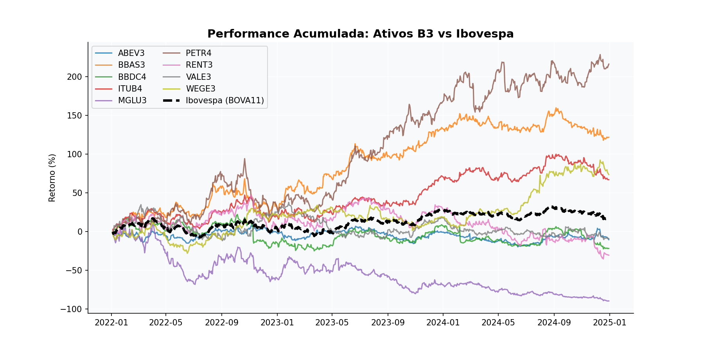

# 📊 Análise Exploratória de Ações - B3 (2022-2024)

Este projeto realiza uma análise quantitativa de ativos da bolsa brasileira, comparando performance e volatilidade com o índice Ibovespa.

---

## 🎯 Objetivo
Desenvolver uma ferramenta de análise exploratória de dados (EDA) para identificar padrões de retorno em diferentes setores da B3, utilizando dados reais via `yfinance`.

## 📁 Estrutura do Projeto
- `analise_b3.py`: Script principal de coleta e processamento.
- `requirements.txt`: Lista de dependências do projeto.
- `graficos/`: Pasta contendo os resultados visuais gerados.

## 🚀 Como Executar
Instale as dependências e rode o script:

```bash
pip install -r requirements.txt
python analise_b3.py
```

## 📈 Resultados da Análise

Aqui está a performance acumulada dos ativos analisados:



---

## 📝 Autor

**Bernardo Esteves Miller Machado** Estudante de Ciência de Dados e IA — IBMEC RJ  
Foco em Mercado Financeiro e Análise Quantitativa.